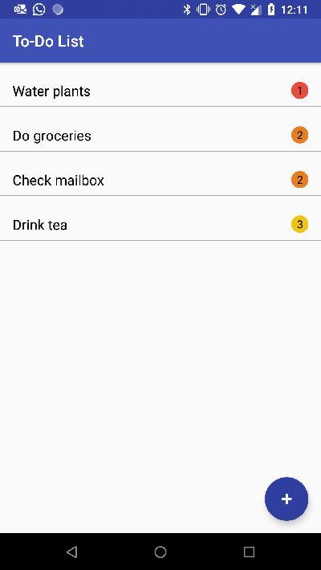
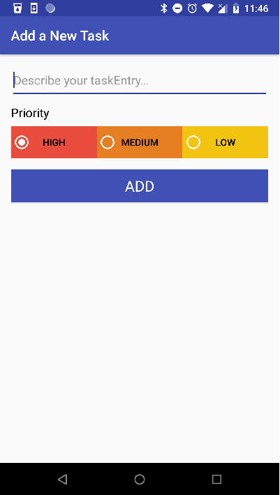

# ToDo-List
A To Do list app that lets user enter a task with its priority. User can swipe to delete a task. App uses RecyclerView 
to display the tasks, Content Provider to store the data. This app was done as part of Udacity's Android Developer coursework.

 |    
